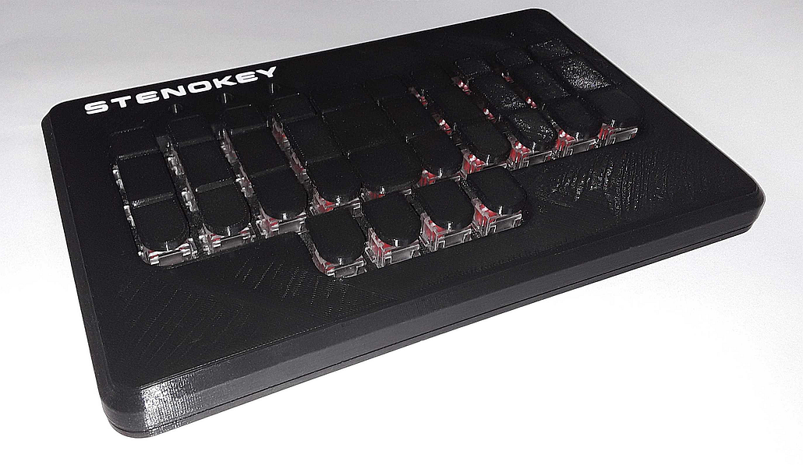

# Stenokey - pico
This is a mod of Mike ady's Stenokey I have only 
tried to improve on their work and make it more accessible/affordable.

This fork implements a Pico and removes all components on the PCB except the switches. 
Configuration is done in software. 

The firmware was uploaded with Arduino using the pico board found in the board manager.
the default driver is TX Bolt and can be set in Plover's Configuration. The baud rate is 115200.
All drivers should work except NKRO keyboard since it's implemented as a teensy 
builtin protocol at this time.

---

Stenographic keyboard

Stenokey is an open source do it yourself stenographic keyboard project.  It is aimed 
at makers with some electronics experience (soldering) and who own a 3D printer 
or who have a friend with a 3D printer.

Stenokey connects to any desktop or laptop PC that has a USB port.  It is meant 
to work with the Open Steno Project's Plover software, which runs on Linux, Mac and 
Windows.

This project consists of four main parts:

- The OpenSCAD source code for all of the 3D printed plastic parts is in the main 
directory.  Printer ready .STL files for the key tops are in the Key\_Print\_Files 
directory.  The .STL files for the case are in the Case\_Print\_Files directory.  

- The bill of materials (BOM) for populating the circuit board is in the main 
directory.  The PCB design files are in the PCB directory.

- The Arduino based firmware is in the Firmware directory.

- Documentation for the project, including build instructions, programming and testing 
instructions and a user manual are all in the Documentation Directory.
